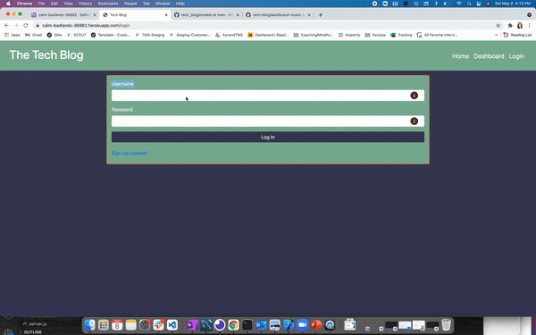

# tech_blog

[](https://opensource.org/licenses/MIT)


## Description 📁

This project required a front end and backend build out using the MVC architectural structure. I used Express.js API to connect to mySQL database (Model), used a combination of JavaScript & Bootstrap on the front end (View) and used express.Router for my Controllers. A new user can view blogs created by other users on the homepage. If you try to go to the dashboard you are prompted to either sign up or log in. Upon sign up, your password will be safely hashed in the database. If you navigate back to the dashboard, you will see any existing blog posts made by you already, or the option to make a new one.

## User Story 👩

```md
AS A developer who writes about tech
I WANT a CMS-style blog site
SO THAT I can publish articles, blog posts, and my thoughts and opinions
```

## Acceptance Criteria ✅

```md
GIVEN a CMS-style blog site
WHEN I visit the site for the first time
THEN I am presented with the homepage, which includes existing blog posts if any have been posted; navigation links for the homepage and the dashboard; and the option to log in
WHEN I click on the homepage option
THEN I am taken to the homepage
WHEN I click on any other links in the navigation
THEN I am prompted to either sign up or sign in
WHEN I choose to sign up
THEN I am prompted to create a username and password
WHEN I click on the sign-up button
THEN my user credentials are saved and I am logged into the site
WHEN I revisit the site at a later time and choose to sign in
THEN I am prompted to enter my username and password
WHEN I am signed in to the site
THEN I see navigation links for the homepage, the dashboard, and the option to log out
WHEN I click on the homepage option in the navigation
THEN I am taken to the homepage and presented with existing blog posts that include the post title and the date created
WHEN I click on an existing blog post
THEN I am presented with the post title, contents, post creator’s username, and date created for that post and have the option to leave a comment
WHEN I enter a comment and click on the submit button while signed in
THEN the comment is saved and the post is updated to display the comment, the comment creator’s username, and the date created
WHEN I click on the dashboard option in the navigation
THEN I am taken to the dashboard and presented with any blog posts I have already created and the option to add a new blog post
WHEN I click on the button to add a new blog post
THEN I am prompted to enter both a title and contents for my blog post
WHEN I click on the button to create a new blog post
THEN the title and contents of my post are saved and I am taken back to an updated dashboard with my new blog post
WHEN I click on one of my existing posts in the dashboard
THEN I am able to delete or update my post and taken back to an updated dashboard
WHEN I click on the logout option in the navigation
THEN I am signed out of the site
WHEN I am idle on the site for more than a set time
THEN I am able to view comments but I am prompted to log in again before I can add, update, or delete comments
```

## Technologies Used 💻

- Node.js
- JavaScript
- mysql
- express
- express-session
- sequelize
- handlebars

## Preview 🔍

;

Check out the DEPLOYED application here:

- https://calm-badlands-36882.herokuapp.com/

## Challenges/Known Issue 🔴

For this application, I definitely ran into a number of challenges as it relates to routes. Having worked through those were are two known issues I couldn't resolve, but would be good to revisit for future development.

Incomplete/Unresolved:

- Commenting:
  When a user is on the homepage, they can click on the title of the blog post to share their thoughts. Once the button has been clicked to the post the comment, it is saved to the database. I intentionally left the user on the comments page so they can see their comment displayed/added to the blog post. However, I was having issue thinking through how to serve up the correct handlebars view. On button click, I create a new database entry of the user's comment, but I couldn't think through how to create an additional action where I can use JavaScript to fetch the comments from the DB to view.

## Resources 💡

For this application I definitely leaned heavily on the Learning Assistant team to give me an extra set of eyes and guidance through debugging some route issues

## License

This project is covered under the MIT license.
